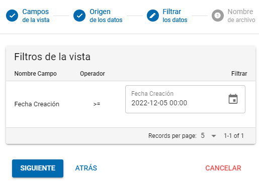

# Exportación Masiva de Excel

1. Diríjase al módulo del cual desea exportar los datos.
2. Pinche en los 3 puntos verticales que se encuentran en la parte derecha.

&#x20;                             .png>)&#x20;

3\.   Presione en "Exportar a Excel".

&#x20;                                       .png>)

4\.   Seleccione los campos que desea exportar y presione siguiente.

5\.   Seleccione la opción "Remoto" y presione siguiente.

&#x20;                               .png>)

6\.   En el campo "Fecha de Creación", usted podrá seleccionar en el ícono de calendario, la fecha desde la cual quiere traer los datos. Al colocar esa fecha le traerá la información desde ese momento a la fecha actual. Luego presione siguiente.

&#x20;                                

7\.   Presione "Exportar".

8\.   Le llegará una notificación que podrá visualizar en la parte superior, en el ícono de campana, que le indicará que sus datos están siendo exportados.

