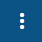

# Introducción


**Sitio Web Confidencial**

Todo el contenido de esta página son confidenciales y no puede ser replicada, copiada o usada sin la previa autorización de **EURUS PRO SpA** de Chile.


En el Centro de Ayuda encontrará con una guía básica que le permitirá familiarizarse con los módulos disponibles para la gestión de Órdenes de Trabajo

## ¿Cómo crear una Orden de Trabajo?

1. Ingrese al módulo Ordenes de Trabajo y pinche en .png>)
2. Seleccione y/o llene cada uno de los campos en Datos de la OT, Localización ATM, Responsables.
3. Pinche en el botón guardar y cerrar que se encuentra en la parte superior derecha.

## ¿Cómo agregar un Servicio al Orden de Trabajo?

1. Dentro de la Orden de trabajo creada, presione el Tab de Servicios que se encuentra en la parte superior del formulario y pinche en .png>)
2. En Información del Servicio, seleccione y/o llene todos los campos que necesita para generar ese servicio.
3. Pinche en el botón guardar y cerrar que se encuentra en la parte superior derecha.

## ¿Cómo configurar un Servicio?

1. Ingrese al Maestro de Servicios y pinche en .png>)
2. En la Configuración del Servicio, seleccione el Cliente, el nombre que llevará ese servicio, el precio que tendrá y la moneda.
3. Luego, seleccione cuál de los items desea que se visualice en el formulario cuando vaya a agregar ese servicio a la orden.
4. Pinche guardar y cerrar.
5. Realizado los pasos anteriores, al crear una OT y en función del cliente a quien se le haya generado la OT, al agregar un servicio a esa OT, en el campo Servicios se le desplegará cada uno de los servicios configurados en el Maestro de Servicios para ese cliente.

## ¿Cómo configurar un ATM?

1. Ingrese al Maestro de ATM y pinche en .png>)
2. Dentro del formulario Configuración ATM, coloque el N° ATM, el Nombre y el Cliente a quien será asignado. Ingrese también la dirección y de ser necesario alguna instrucción adicional.
3. Presione guardar y cerrar.
4. Realizando estos pasos, al crear una OT y en función del cliente a quien se le haya generado la OT, en Localización ATM, en el campo ATM, le desplegará todos los que se hayan configurado en el  Maestro de ATM para ese cliente.

## ¿Cómo crear un Cliente?

1. Ingrese al Maestro de Clientes y pinche en .png>)&#x20;
2. Ingrese en los campos la información del cliente: Nombre, Rut, Dirección y seleccione el campo Activo para que este cliente pueda visualizarlo al crear una OT.
3. Podrá configurar el cliente por color, es decir, para que cuando cree una OT y seleccione el cliente, este será identificado con el color que haya configurado en el Maestro de Clientes.
4. Finalmente presione guardar y cerrar.

## ¿Cómo crear un Contacto?

Para configurar un Contacto se puede hacer a través del Maestro de Contactos o dentro del Maestro de Clientes.

### Creación del Contacto a través del Maestro de Contactos

1. Ingrese al Maestro de Contactos y pinche en .png>)&#x20;
2. Ingrese los Datos del Contacto: Nombre (s), Apellidos y seleccione el campop Activo.
3. En Configuración del Contacto, ingrese el Cliente (que será asociado a ese contacto), el correo  y de ser necesario el Whatsapp.
4. Finalmente presione guardar y cerrar.

### Creación del Contacto a través del Maestro de Clientes.

1. Ingrese al Maestro de Clientes.
2. Proceda a crear el Cliente. si el Cliente ya fue creado, pinche en el mismo para proceder con la creación del o los contactos.
3. Pinche en el Tab de Contactos.
4. Pinche en .png>)&#x20;
5. Proceda a llenar los Datos del Contacto: Nombre(s), Apellidos y seleccione Activo.
6. En Configuración del Contacto, por defecto, le aparecerá el Cliente al que estará asociado ese contacto. Podrá ingresar el Correo y de ser necesario el Whatsapp.
7. Presione guardar y cerrar.


En cada uno de los módulos, dentro del formulario, en la parte superior, aparecen 3 puntos en forma vertical  si pincha allí se le desplegará 2 opciones, **Guardar y Nuevo** donde le guardará lo creado y le habilitará un nuevo formulario y **Clonar** que le traerá un formulario con todos los datos ingresados en el anterior.


&#x20;

####

###

##
